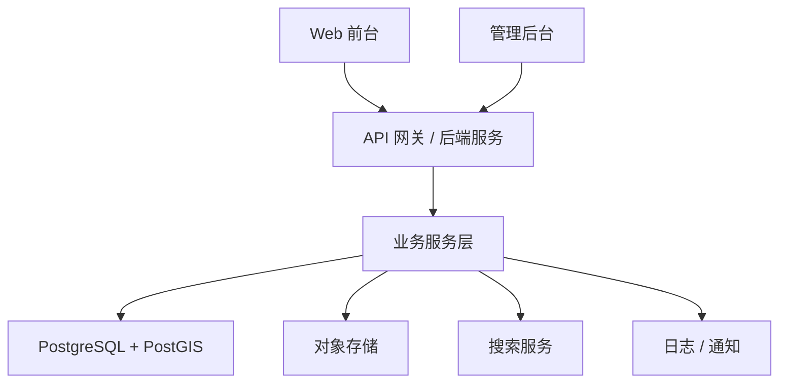
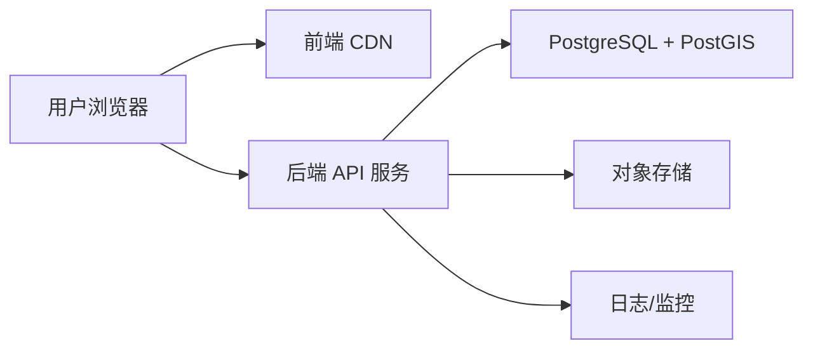

# 庐山抗战文化景观可视化平台
## 总体技术架构设计

## 1. 技术目标
- 前台轻量、主题聚焦、交互流畅。
- 后台结构完整，支撑数据治理、审核、导出和后续 AI 扩展。
- 数据模型先行，避免首版做成只能展示的静态页面。
- 允许后续扩展，但不让未来需求污染首版架构。

## 2. 推荐技术栈

| 层级 | 推荐 |
| --- | --- |
| 前端框架 | React + TypeScript + Vite |
| UI | Tailwind CSS + 组件库（可选 shadcn/ui） |
| 地图 | Mapbox GL JS 或 MapLibre GL JS |
| 状态管理 | Zustand / Redux Toolkit |
| 图表 | ECharts（P2 再重点使用） |
| 后端 | Node.js + NestJS 或 Python + FastAPI |
| 数据库 | PostgreSQL + PostGIS |
| 对象存储 | S3 兼容对象存储 / OSS / COS |
| 鉴权 | JWT + Refresh Token |
| 搜索 | PostgreSQL Full Text Search 起步，后续可接 Elasticsearch / 向量检索 |
| 部署 | 前后端分离；前端 CDN，后端 API 服务，数据库独立 |

## 3. 系统分层

## 4. 逻辑模块

| 模块 | 说明 |
| --- | --- |
| 地图展示模块 | 点位、底图、时间轴、详情 |
| 搜索检索模块 | 地点 / 人物 / 事件全局搜索 |
| 用户模块 | 登录、注册、个人中心 |
| UGC 模块 | 提交、校验、待审核 |
| 审核模块 | 编辑后发布、驳回、日志 |
| 导出模块 | 申请、审批、下载 |
| 数据管理模块 | 地点、人物、事件、区域、来源、媒体 |
| 配置模块 | 默认底图、图层、视角、功能开关 |
| 通知模块 | 审核和审批结果 |

## 5. 部署拓扑

## 6. 关键架构决策

### 6.1 为什么前台轻量而不是 Cesium 重架构
- 当前首版以专题化三维地图和地点叙事为主。
- Mapbox / MapLibre 足以承载首版 3D 地形、点位、筛选与时间叙事。
- 复杂动态流网络、UE5、AR 已被明确放到后续。

### 6.2 为什么后台仍采用关系型数据库
- 平台核心并不是纯地图，而是地点、人物、事件、区域、来源之间的知识关系。
- 搜索、审核、导出、个人中心都需要稳定事务和明确关联。

### 6.3 为什么首版不直接上 AI
- AI 的前提不是模型，而是干净、结构化、可信的数据。
- 首版应先完成可检索实体和关系建设，为后续 RAG 留足条件。

## 7. 安全架构
- 普通用户与管理员分离认证。
- 管理员注册需邀请码或审核。
- 受限接口全部鉴权。
- 上传文件需进行类型、大小、内容校验。
- 导出采用审批制，不开放匿名下载。

## 8. 后续扩展接口
- AI 检索与智能问答
- 复杂空间分析
- 多区域复用
- 版本管理
- AR 与沉浸式场景

