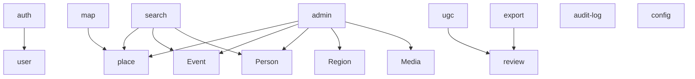

# 后端架构详细设计

## 1. 模块划分



## 2. 服务模块
| 模块 | 说明 |
| --- | --- |
| auth | 登录、注册、token、管理员鉴权 |
| user | 用户资料、个人中心 |
| place | 地点 CRUD 与查询 |
| event | 事件 CRUD |
| person | 人物 CRUD |
| region | 区域 CRUD |
| media | 媒体管理 |
| source | 来源管理 |
| search | 全局搜索 |
| timeline | 时间轴数据 |
| ugc | 用户提交 |
| review | 审核 |
| export | 数据导出申请 |
| config | 系统配置 |
| audit-log | 日志 |
| notification | 站内消息 |

## 3. 关键业务流
### UGC 审核流
1. ugc.createSubmission
2. validator.validateSubmission
3. review.createPendingTask
4. admin.review
5. if approve -> publishService.writeToFormalTables
6. notification.send
7. auditLog.record

### 导出审批流
1. export.createRequest
2. admin.review
3. if approve -> export.generateFile
4. permission.issueDownloadToken
5. auditLog.record

## 4. 后端目录建议
```text
src/
  modules/
    auth/
    user/
    place/
    event/
    person/
    region/
    media/
    source/
    search/
    timeline/
    ugc/
    review/
    export/
    config/
    notification/
    audit-log/
  common/
  infra/
  database/
```

## 5. 非功能实现
- RBAC 基础权限
- 文件上传白名单
- 请求限流
- 审核与审批事务化
- 日志统一中间件

